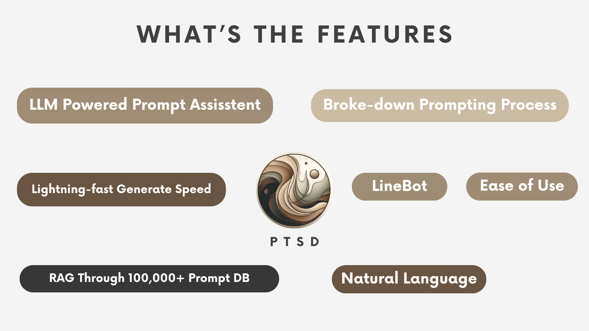
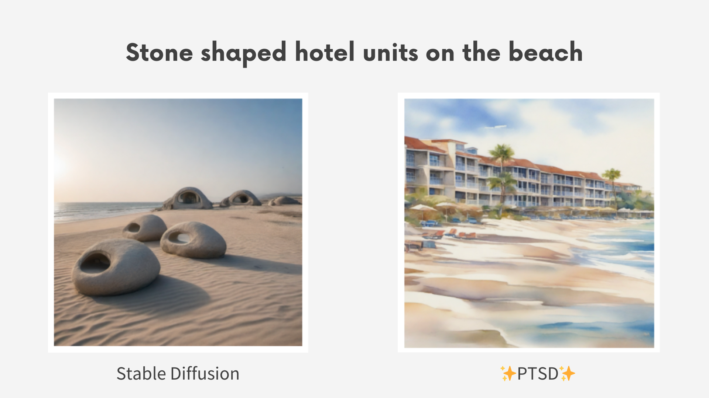
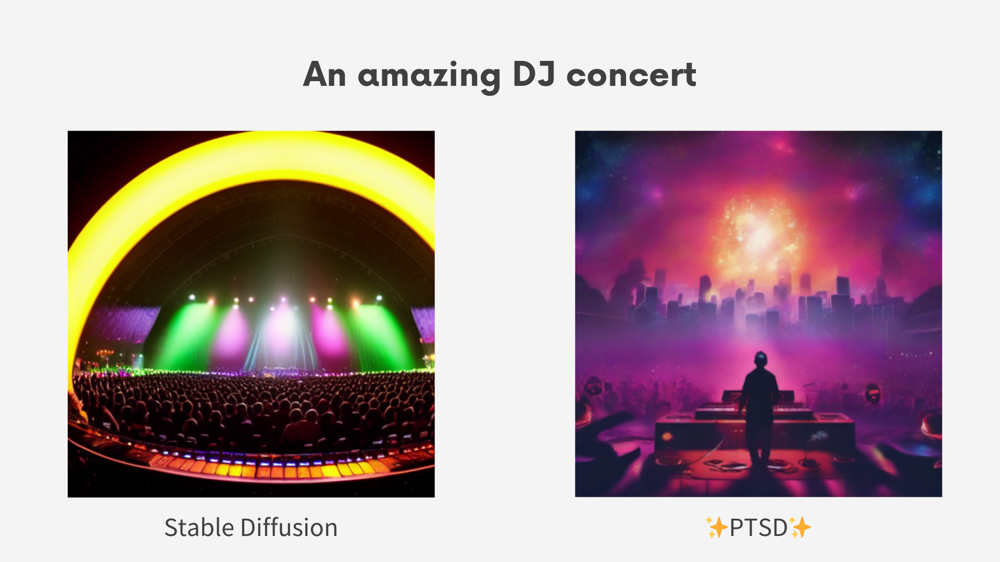
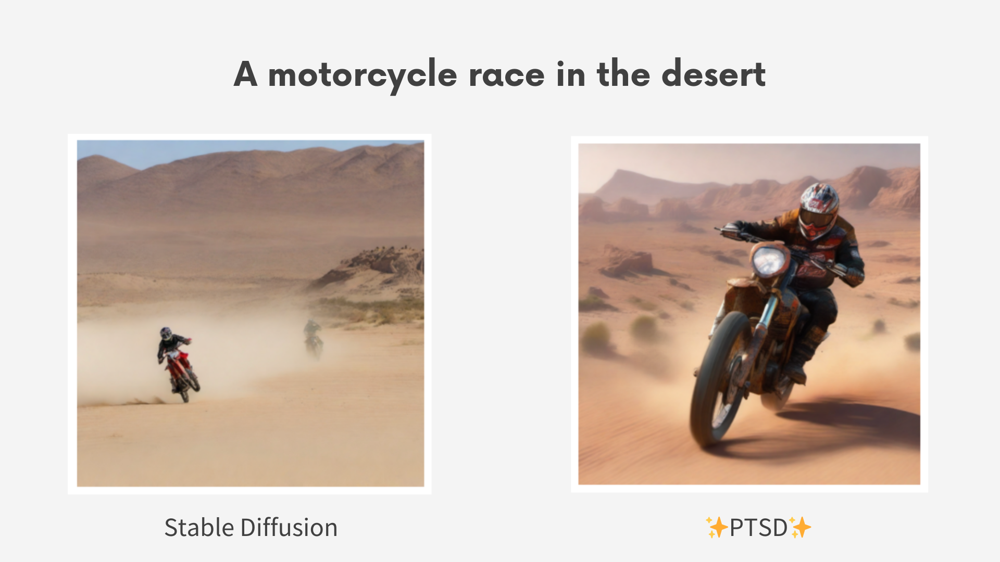

[](https://opensource.org/licenses/MIT)

# Prompt Stable Diffusion
Welcome to the "Prompt Tuning Stable Diffusion" project! This innovative initiative is designed to assist users in creating effective image generation prompts. Leveraging advanced Large Language Models (LLMs) and Retrieval-Augmented Generation (RAG) techniques, our system guides users step-by-step in crafting high-quality prompts. By integrating with Linebot, we aim to enhance the overall user experience, making the process seamless and user-friendly.

The project addresses the common challenge many users face: the difficulty of writing effective prompts for image generation. With "Prompt Tuning Stable Diffusion," users can receive tailored guidance and suggestions, improving their ability to generate desired images. Our approach combines state-of-the-art AI technology with an intuitive interface, ensuring that both novice and experienced users can benefit from our solution.

# Key Features


# Table of Contents

1. [Overview](#overview)
2. [Key Features](#key-features)
3. [Table of Contents](#table-of-contents)
4. [System Workflow](#system-workflow)
5. [Prerequisite](#prerequisite)
6. [Installation](#installation)
7. [Demo](#demo)
8. [Main Techniques](#main-techniques)
9. [License](#license)
10. [Contact Info](#contact-info)


# System workflow


# Prerequisite

Before installing and starting this project, make sure you have the following modules:

- Ollama (Or you can use OpenAI model)
- Self-hosted stable diffusion API

#### If you don't have these modules, follow these steps for simple installation

## Ollama

This project uses Ollama to initialize `llama3:8b` as the large language model. To install Ollama, visit [Ollama Download Page](https://ollama.com/download).

## Stable Diffusion

To be able to run a self-hosted Stable Diffusion model, you need to clone another project into the same parent directory as this project.

### Cloning Project

Before cloning the Stable Diffusion repository, change to the parent directory of the PTSD project:

```sh
cd ..
```

Clone the Stable Diffusion Repository:

```sh
git clone https://github.com/VincentLi1216/stable-diffusion.git
```

Change directory into the `stable-diffusion` folder:

```
cd stable-diffusion
```

Run `./stable_diffusion/webui.sh`. This will download dependencies on the first run (approximately 10 minutes).  
Ensure to include `--api` at the end of the command, as the system will not operate without it:

```sh
sh webui.sh --api
```

> This shell script will automatically create an environment named `venv`. It is recommended to set the Python version to 3.9.x to ensure smooth operation.

> Once you run this script, you will be able to send requests for generating images via localhost:7860.

### Downloading Models

#### Method1: Google Drive

1. Navigate to **[My Google Drive](https://drive.google.com/drive/u/0/folders/1sGHcNInrKNdsd3m_XNn9Q8Zveya1S7uS)**, and download `sd_xl_base_1.0.safetensors` and `lcm_lora_sdxl.safetensors`.
2. Move `sd_xl_base_1.0.safetensors` to `./models/Stable-diffusion`.
3. Move `lcm_lora_sdxl.safetensors` to `./models/Lora`

#### Method2: Hugging Face

1. Go to [Hugging Face URL1](https://huggingface.co/stabilityai/stable-diffusion-xl-base-1.0/tree/main) and download `sd_xl_base_1.0.safetensors`
2. Go to [Hugging Face URL2](https://huggingface.co/latent-consistency/lcm-lora-sdxl/blob/main/pytorch_lora_weights.safetensors) and download `pytorch_lora_weights.safetensors`
3. Rename `pytorch_lora_weights.safetensors` to `lcm_lora_sdxl.safetensors`
4. Move `sd_xl_base_1.0.safetensors` to `./models/Stable-diffusion`.
5. Move `lcm_lora_sdxl.safetensors` to `./models/Lora`

### Rerunning the system

Close the previous section:

```
ctrl+c
```

Run it once again.  
Ensure to include **--api** at the end of the command, as the system will not operate without it:

```sh
sh webui.sh --api
```

# Installation

Clone this repository:

```sh
git clone https://github.com/ReeveWu/articulate-ai.git
```

Here are two ways to use this project:

- Integrate with LINE Bot
- Run in the Terminal (Coming soon)

## Integrate with LINE Bot

To run this project on a LINE Bot, you need to first create a **Message API** product on the [LINE Developer page](https://developers.line.biz) and save its `CHANNEL ACCESS TOKEN` and `CHANNEL SECRET`.

### Creating Environment Variables

Create a `.env` file in the root directory of the project and write the following environment variables:

```sh
CHANNEL_ACCESS_TOKEN='<CHANNEL_ACCESS_TOKEN>'
CHANNEL_SECRET='<CHANNEL_SECRET>'
LINE_BOT_WEBHOOK_URL='<LINE_BOT_WEBHOOK_URL>'

IMGUR_CLIENT_ID='<IMGUR_CLIENT_ID>'
STABLE_DIFFUSION_API='<STABLE_DIFFUSION_API>'
```

- Ensure you replace `CHANNEL_ACCESS_TOKEN` and `CHANNEL_SECRET` with your actual LINE Bot credentials obtained from the LINE Developer page.

- Fill in the `LINE_BOT_WEBHOOK_URL` with the publicly accessible URL on port 5000 (you can use **ngrok** to achieve this).

- The `IMGUR_CLIENT_ID` can be obtained after registering on [Imgur](https://imgur.com/).

- `STABLE_DIFFUSION_API` will be `localhost:7860` if you follow the previous step to install the stable diffusion model.

### Run the webhook server for LINE Bot

Update the webhook URL

```sh
sh linebot_setup.sh
```

Create a Python 3.x virtual environment (optional)

```sh
python3 -m venv .venv
```

```sh
source .venv/bin/activate
```

Install the requirements

```sh
pip install requirements.txt
```

Finally, execute the following script to start the server

```sh
python main.py
```

Then you will see a webhook server created by Flask running on port 5000.

# Demo





# Main Techniques

# License
This project is licensed under the MIT License - see the [LICENSE](LICENSE) file for details

# Contact Info
## Vincent Li
Github repo: [https://github.com/VincentLi1216](https://github.com/VincentLi1216)  
Email: [sunnus.tw@gmail.com](sunnus.tw@gmail.com)

## Reeve Wu
Github repo: [https://github.com/ReeveWu](https://github.com/ReeveWu)  
Email: [reeve0319@gmail.com](reeve0319@gmail.com)